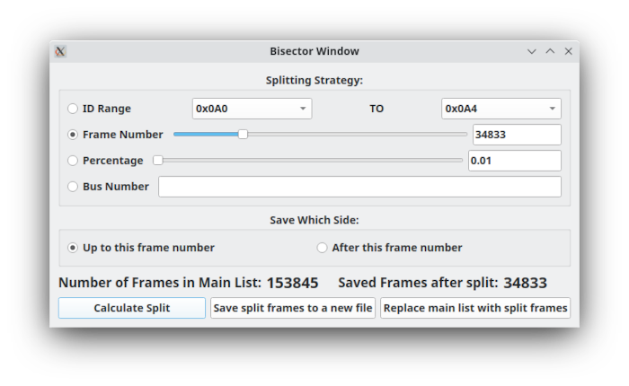

# Frame Bisector

Frame Bisector creates a selected subset of the current frame collection. It is useful when isolating a time range, frame-index region, CAN ID range, or bus for reverse-engineering, export, and comparison work.

The tool divides the current frame list into two logical sections. You choose which section to retain, then save that subset or replace the main frame collection with it.

## Split modes

| Mode | Selection behavior |
|---|---|
| Frame number | Select frames before or after a chosen index |
| Percentage | Select frames before or after a percentage through the current collection |
| CAN ID range | Select frames inside or outside the selected ID range |
| Bus number | Select frames on, or not on, the selected bus |

### CAN ID range

CAN ID range selects a continuous range of IDs. It does not support choosing arbitrary individual IDs.

If you need to retain a non-contiguous selection of IDs, use the main-window filter interface to select the IDs you want, then save the filtered frame list from the File menu.

### Frame number

Frame-number mode splits at the specified frame index. Frames up to the selected frame are on one side of the split; subsequent frames are on the other side.

### Percentage

Percentage mode works like frame-number mode, but selects the split position as a percentage through the current frame collection.

### Bus number

Bus-number mode includes or excludes frames from a selected bus. It can be useful for separating a multi-bus capture into one capture per bus.

## Typical workflow

1. Load or capture the frame collection you want to investigate.
2. Open Frame Bisector.
3. Choose a split mode and configure its value or range.
4. Choose whether to retain the lower/inside or upper/outside section.
5. Select **Calculate Split**.
6. Review the total frame count and calculated subset count.
7. Save the subset to a file or replace the current main frame collection.

After calculating the split, SavvyLens displays how many frames exist in the original collection and how many frames the selected result contains. Review those counts before continuing.

## Saving a subset

Select **Save Split Frames to a New File** to export the calculated subset without changing the current main frame collection.

The save action uses SavvyLens file-export support. Choose the destination format deliberately; only formats with export support can be written successfully.

Saving the subset first is the safest workflow when you are exploring a capture and may need the original data later.

## Replacing the main collection

Select **Replace Main List With Split Frames** to clear the current main frame model and insert the calculated subset.

> **Caution:** Replacing frames discards the excluded frames from the current main collection. Save the original capture or save the split result first if you may need to return to the original data.

This action is useful when you want other SavvyLens windows to operate only on the narrowed frame set.