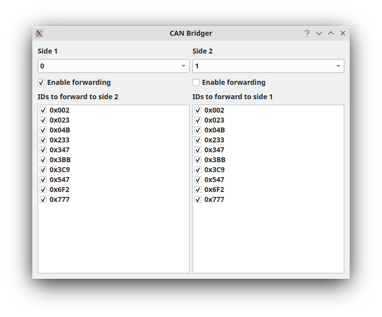

# CAN Bridge

CAN Bridge forwards selected CAN frames between two live buses. It tracks observed IDs on each side and lets you enable forwarding independently in each direction.

The two buses may come from the same adapter or from different connected hardware adapters.

> **Safety notice:** Bridging can create sustained traffic, duplicate commands, or feedback loops. Do not enable both directions without understanding the network topology and the effect of rebroadcast traffic.

## Typical workflow

1. Ensure both target buses are configured and active.
2. Open CAN Bridge.
3. Select Side 1 and Side 2 bus numbers.
4. Confirm that the selected sides are different buses.
5. Observe detected IDs on each side.
6. Select only the IDs intended to be forwarded.
7. Enable forwarding from Side 1 to Side 2 or Side 2 to Side 1 as needed.
8. Monitor traffic and disable forwarding immediately if behavior is unexpected.

By default, forwarding is disabled in both directions.

## Behavior

For a selected direction, the bridge observes incoming frames on one side, changes the frame's bus value to the opposite side, and sends it through the connection manager.

Each side has an independent list of known IDs and enabled selections:

- Frames observed on Side 1 add their IDs to the Side 1 list.
- Frames observed on Side 2 add their IDs to the Side 2 list.
- Each ID can be independently enabled or disabled for forwarding.
- Unchecking an ID prevents that ID from being forwarded in the associated direction.

The bridge uses the current captured-frame stream to observe traffic. New IDs are added to the appropriate side’s list as they appear.

## Directional forwarding

Enable only the direction you need:

- **Side 1 to Side 2** forwards selected traffic received on Side 1 to Side 2.
- **Side 2 to Side 1** forwards selected traffic received on Side 2 to Side 1.

Start with one-way forwarding whenever possible.

## Bidirectional bridge warning

Bidirectional forwarding can create an infinite feedback loop:

1. A frame arrives on Side 1.
2. The bridge forwards it to Side 2.
3. The frame is then observed on Side 2.
4. The reverse bridge forwards it back to Side 1.
5. The process repeats.

This can rapidly create excessive traffic and may interfere with connected devices or networks.

Treat bidirectional forwarding as an advanced configuration. Do not enable it unless the surrounding network topology or external hardware prevents reflected traffic from returning to the bridge.

## Safety checklist

Before enabling forwarding:

- Confirm both selected buses are active and are not the same bus.
- Confirm the intended direction of travel.
- Enable only the IDs that are necessary.
- Start with one-way bridging.
- Watch the traffic rate after enabling forwarding.
- Disable forwarding immediately if unexpected traffic, duplicated messages, or feedback behavior appears.