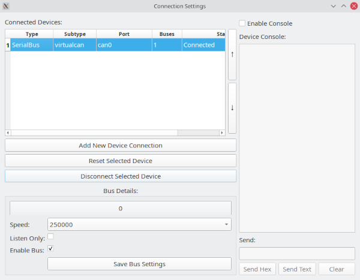

# Connections

The Connections workflow configures SavvyLens CAN interfaces and transport backends. Available backends depend on the platform and build configuration and may include serial/GVRET, LAWICEL, SocketCANd, MQTT, and server-oriented connections.

The Connection Window is also used to add, remove, connect, disconnect, and modify configured devices and buses.

## Typical workflow

1. Open the Connection Window.
2. Select **Add New Device Connection**.
3. Select the backend and enter its transport settings.
4. Connect and confirm that the expected bus appears.
5. Verify incoming frames in the main frame table before using transmit-capable tools.

Some devices can expose more than one CAN bus while appearing as a single configured device in the connection list.

## Managing connections

### Adding a connection

Select **Add New Device Connection** and enter the settings for the required backend.

The required values depend on the connection type. They may include:

- Serial port and baud rate.
- Network hostname and port.
- SocketCAN interface name.
- MQTT broker address, port, topic, and credentials.
- Device-specific CAN bitrate or protocol settings.

After saving or connecting, confirm that the expected bus or buses appear in the connection list.

### Modifying a connection

Select a bus or device from the connection list. You can disconnect it or adjust its settings in the parameter area.

Select **Save Bus Settings** to apply changes.

Devices with multiple buses show separate tabs in the **Bus Details** area. Confirm that you are editing the intended bus before saving changes.

### Removing a connection

Select the device in the connection list and choose **Remove Selected Device**.

Removing a device removes its configured connection entry. Stop playback, frame sending, scripts, bridging, or other traffic-dependent tools before removing an active connection.

## Before transmitting

Confirm all of the following:

- The selected bus number is the intended physical or logical bus.
- The connection is receiving expected traffic.
- Bitrate and interface settings match the target network.
- You understand whether the backend supports transmission, reception, or both.
- The device is not configured in listen-only mode if you intend to transmit.
- Playback, scripting, custom sender, fuzzing, or CAN Bridge are configured for the correct bus.

Verify reception first whenever possible. A known-good passive capture is usually safer than immediately testing transmission on an unfamiliar network.

## Troubleshooting

- Verify cabling, adapter power, interface name, and permissions.
- For serial backends, verify the selected port and baud settings.
- For SocketCAN-style backends, verify the interface is up and configured.
- Confirm CAN bitrate and physical bus wiring match the target network.
- If frames are absent, test with a known-good passive capture setup before changing application filters.
- If a configured device exposes multiple buses, confirm that you are monitoring the correct bus tab and bus number.

## GVRET debugging console

GVRET devices are serial devices with substantial configuration options. This flexibility can also make them harder to troubleshoot.

The Connection Window includes a debugging console for supported GVRET connections:

1. Select the relevant bus in the connection table.
2. Select **Enable Console**.
3. Review the serial traffic and extended status messages.

The console can show what SavvyLens sends to the device and what it receives in return. This can help identify incorrect port selection, firmware behavior, protocol mismatches, or connection problems.

The console also provides manual send controls:

- **Send Hex** sends space-separated hexadecimal byte values.
- **Send Text** sends the entered text as raw text.

GVRET traffic is normally binary, so **Send Text** is generally not useful for normal GVRET protocol traffic. Some GVRET firmware supports a text console, however. When using a serial terminal with such firmware, entering `?` followed by a line ending such as `CR`, `LF`, or `CRLF` may display its supported text commands.

> **Caution:** Manual console transmission can alter device behavior. Use it only when you understand the target device and protocol.