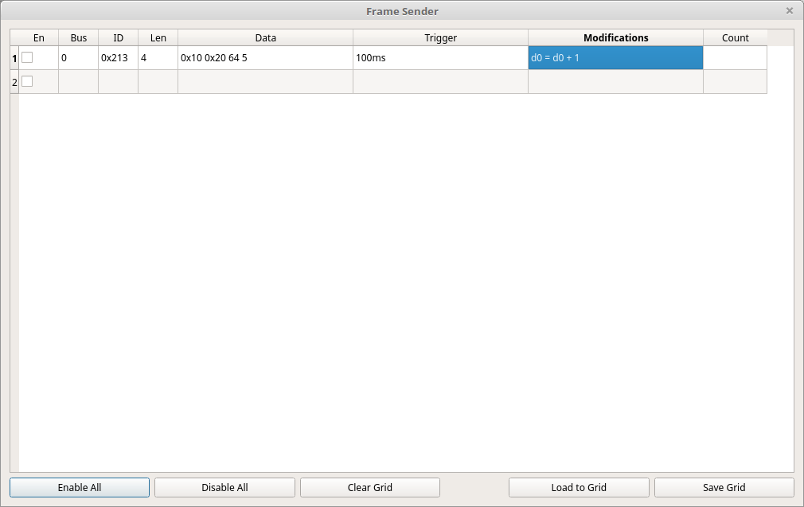

# Custom Sender



Custom Sender is a trigger-based CAN transmit tool. It lets you define outgoing frame rows, choose when each row sends, and optionally modify payload bytes using constants, the row’s existing data, or bytes from recently received frames.

It can be used to:

- Send periodic frames.
- Send a response after a matching incoming frame.
- Delay or limit a response.
- Construct an outgoing payload from observed traffic.
- Test known CAN behavior in a controlled environment.

> **Safety notice:** Custom Sender can transmit automatically and repeatedly. Incorrect bus selection, ID selection, trigger logic, modifier logic, or timing can create unsafe traffic on a live network. Start with disabled rows, low-rate test traffic, a known-safe test bus, and a limited trigger count whenever possible.

## Typical workflow

1. Open Custom Sender.
2. Add or configure one frame row.
3. Select the target output bus.
4. Enter the intended CAN ID, frame length, and initial payload data.
5. Leave the row disabled while configuring and reviewing its trigger/modifier logic.
6. Start with a simple, bounded trigger such as a low-rate timer or a one-time response.
7. Enable the row.
8. Watch the **Count** field and observed traffic.
9. Disable the row immediately if behavior is unexpected.

Before using dynamic modifiers, first test the same frame with a fixed payload. This makes it much easier to distinguish a payload-construction mistake from a bus, trigger, or timing issue.

## Frame rows

Custom Sender is organized as a grid. Each row defines an independently configurable outgoing frame.

| Field | Meaning |
|---|---|
| `En` | Enables the row. Disabled rows do not send. |
| `Bus` | Target bus used to transmit the frame. |
| `ID` | Outgoing CAN ID. Decimal and `0x`-prefixed hexadecimal values are accepted. |
| `Len` | Number of payload bytes to send. |
| `Data` | Initial payload bytes. Modifiers can change these values before a frame is sent. |
| `Trigger` | Rules that decide when this row sends. |
| `Modifications` | Rules that update payload bytes before the row sends. |
| `Count` | Number of frames sent by this row. |

The `Count` column is useful for confirming that a trigger is firing at the rate you intended.

## Trigger rules

A trigger defines when its row is eligible to send.

A row can have multiple triggers. Separate individual triggers with a comma:

```text
trigger1,trigger2
```

Within one trigger, separate conditions with spaces:

```text
condition1 condition2 condition3
```

### Trigger conditions

| Condition | Meaning | Example |
|---|---|---|
| `id<ID>` | Trigger when a frame with the specified CAN ID is received | `id0x200` |
| `<milliseconds>ms` | Delay after an ID match, or trigger periodically when used without an ID condition | `40ms` |
| `<count>x` | Limit the trigger to the specified number of firings | `100x` |
| `bus<bus>` | Restrict an ID-based trigger to frames received on a specified bus | `bus0` |

### ID condition

Use `id` followed by the CAN ID:

```text
id0x200
```

This makes the trigger react when SavvyLens receives a frame with ID `0x200`.

### Time condition

Use a number followed by `ms`:

```text
40ms
```

Time conditions behave differently depending on the rest of the trigger:

- With an ID condition, the row sends after the specified delay following a matching received frame.
- Without an ID condition, the row sends repeatedly at the specified interval.

### Count condition

Use a number followed by `x`:

```text
10x
```

This limits the trigger to the specified number of firings.

Use a count limit while testing whenever possible. An unbounded periodic trigger continues sending until the row is disabled or sending is stopped.

### Bus condition

Use `bus` followed by the expected incoming bus number:

```text
bus0
```

Without a bus condition, an ID-based trigger can react to matching frames received on any bus.

### Trigger example

```text
id0x200 5ms 10x bus0,1000ms
```

This contains two triggers:

1. When a frame with ID `0x200` arrives on bus `0`, wait 5 milliseconds and send the row. Allow this trigger to fire at most 10 times.
2. Also send the row once every 1000 milliseconds without a count limit.

> **Caution:** The second trigger in this example is an unbounded periodic sender. Use a bounded interval and a controlled bus while testing.

## Modifications

Modifiers change outgoing payload bytes before the row sends.

A row can have multiple modifiers. Separate them with commas:

```text
modifier1,modifier2
```

Each modifier begins with the destination byte:

```text
D<byte>=expression
```

For example:

```text
D4=D3
```

This assigns the value of outgoing data byte `3` to outgoing data byte `4`.

The destination byte must be written as `D` or `d` followed by a byte number from `0` through `7`.

## Modifier operands

An expression can use the following operand types.

| Operand | Meaning | Example |
|---|---|---|
| `D<byte>` | A byte from the current row’s outgoing payload | `D3` |
| `ID:<id>` | Select the most recently received frame with the specified CAN ID | `ID:0x200` |
| `BUS:<bus>` | Restrict the selected received frame to a bus | `BUS:0` |
| `<number>` | A decimal or hexadecimal literal | `0x10` |

Operands can include several colon-separated qualifiers.

### Current row data

```text
D3
```

References byte `3` from the row’s current outgoing payload.

### Cached incoming frame data

```text
ID:0x200:D7
```

References byte `7` from the most recently received frame with ID `0x200`.

```text
BUS:0:ID:0x120:D3
```

References byte `3` from the most recently received frame with ID `0x120` on bus `0`.

### Literal values

```text
0x200
```

Uses the literal numeric value `0x200`.

## Modifier operators

Modifiers evaluate supported operations from left to right.

| Operator | Meaning | Example |
|---|---|---|
| `+` | Add | `D1+D2` |
| `-` | Subtract | `D1-D2` |
| `*` | Multiply | `D1*D2` |
| `/` | Divide | `D1/D2` |
| `&` | Bitwise AND | `D1&0x20` |
| `|` | Bitwise OR | `D1|0x10` |
| `^` | Bitwise XOR | `D1^0xD2` |

> **Important:** Modifier expressions are evaluated strictly from left to right. They do not use normal mathematical operator precedence.

For example:

```text
D2=D4*10+D3&0x3F
```

is evaluated as:

1. `D4 * 10`
2. Add `D3`
3. Bitwise-AND the result with `0x3F`
4. Store the result in `D2`

## Modifier examples

### Increment a byte

```text
D0=D0+1
```

Takes the current outgoing value of `D0`, adds `1`, and stores it back into `D0`.

### Build a byte from a received frame

```text
D1=ID:0x200:D3+ID:0x200:D4&0xF0
```

1. Reads byte `3` from the most recently received frame with ID `0x200`.
2. Adds byte `4` from that same frame.
3. Bitwise-ANDs the result with `0xF0`.
4. Stores the result in outgoing byte `D1`.

### Combine local payload bytes

```text
D2=D4*10+D3&0x3F
```

Multiplies outgoing byte `D4` by `10`, adds outgoing byte `D3`, masks the result with `0x3F`, and stores it in `D2`.

## Testing checklist

Before enabling a row:

- Confirm the target bus is the intended physical or logical bus.
- Confirm the output CAN ID and frame length.
- Confirm every data byte and modifier result.
- Confirm whether the trigger reacts to every matching frame or only a limited count.
- Add a count limit for initial testing.
- Confirm the trigger’s source bus if more than one bus may carry the same ID.
- Confirm that cached input IDs are present before using them in modifiers.
- Use a low transmission rate and observe `Count` before increasing activity.
- Keep a means of stopping transmission immediately.

## Troubleshooting

- **A row never sends:** Confirm `En` is checked, the bus is connected, the trigger syntax is valid, and a matching incoming frame is actually arriving when using an ID trigger.
- **A row sends too often:** Check for an unbounded `<milliseconds>ms` trigger, a missing `<count>x` limit, or an ID trigger matching traffic on more buses than expected.
- **The payload is incorrect:** Start with no modifiers and a fixed payload. Then add one modifier at a time and verify the latest source frame for every referenced ID/bus.
- **The wrong bus triggers the row:** Add a `bus<bus>` condition to an ID-based trigger.
- **The output is unsafe or unexpected:** Disable the row immediately, stop sending, and review its trigger, bus, ID, data, and modifier rules before trying again.