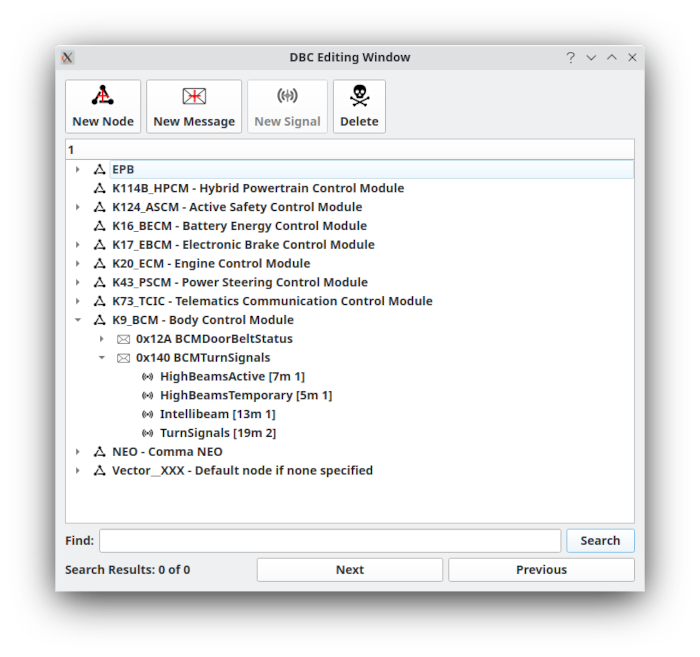

# DBC Editor



The DBC Editor manages DBC files, nodes, messages, and signals used for CAN interpretation and signal-aware features.

It presents DBC content as a tree:

```text
DBC file
└── Nodes
    └── Messages
        └── Signals
```

Each node contains the messages associated with it, and each message contains its signals. Multiplexed and multi-level multiplexed messages are supported.

Double-click a node, message, or signal to open its relevant editor.

## Typical workflow

1. Open or create a DBC file.
2. Add or edit nodes as needed.
3. Add or edit messages with the intended CAN ID and sender.
4. Add signals with start bit, length, byte order, scaling, units, value descriptions, and multiplexing information as appropriate.
5. Save the DBC.
6. Enable frame interpretation or open Signal Viewer to verify decoded behavior against live or captured traffic.

Treat DBC edits as source data: keep backups and use version control for important files.

## Editor shortcuts

| Shortcut | Action |
|---|---|
| `F3` | Move to the previous search result |
| `F4` | Move to the next search result |
| `F5` | Create a new node |
| `F6` | Create a new message |
| `F7` | Create a new signal |
| `Delete` | Delete the selected node, message, or signal |

Additional editor behavior:

- Right-click a node to access special operations.
- Creating a new message while a message is selected creates a clone of the selected message.
- Creating a new signal while a signal is selected creates a clone of the selected signal.
- Creating a new signal while a message is selected assigns that message as the new signal’s parent.
- Nodes, messages, and signals use distinct icons to make the tree easier to scan.
- Signal icons distinguish ordinary signals, multiplexors, and multiplexed signals.

## Nodes

A DBC node represents a device on the CAN bus, such as an ECU, motor controller, battery charger, or other networked component.

Nodes can be assigned as message senders or receivers. This helps organize DBC content and makes messages easier to locate.

To add a node:

1. Select **New Node** or press `F5`.
2. Enter a name.
3. Optionally enter a comment.
4. Expand the node to view its associated messages.

Node comments are retained for reference but are not otherwise used by SavvyLens.

## Messages

A DBC message defines how a CAN frame ID is interpreted.

For conventional DBC messages, one DBC message normally corresponds to one CAN ID. J1939 and GMLAN may use special masking, so multiple actual CAN IDs can map to one DBC message definition while still referring to the same relevant J1939 PGN or protocol-level message.

When creating or editing a message:

- Set the correct CAN ID.
- Set the message length accurately.
- Set the sender node and a meaningful message name.
- Configure text and background colors only when they improve readability.

SavvyLens attempts to populate the message data-length field when you enter an ID. Signal definitions cannot extend beyond the message length, so verify the message length before defining signals.

Message text and background colors can be shown in the main frame table when frame interpretation is enabled. Use colors sparingly; low-contrast or excessive colors can make the frame table difficult to read.

## Signals

Signals define how individual values are extracted from a message payload.

For each signal, define the appropriate:

- Name and optional comment.
- Start bit.
- Bit length.
- Byte order.
- Signed or unsigned interpretation.
- Scaling factor and offset.
- Minimum and maximum values, where applicable.
- Units.
- Enumerated value descriptions, where applicable.
- Receiver nodes.
- Multiplexor or multiplexing conditions, when applicable.

Validate signal definitions against known payloads before relying on them for interpretation, transmission triggers, or automated behavior.

## Multiplexed signals

Multiplexed messages use one signal—the **multiplexor**—to determine which other signals are active for a given frame.

For multiplexed signals to decode correctly:

1. Define the multiplexor signal correctly.
2. Define each multiplexed signal’s multiplexing condition correctly.
3. Confirm the message’s bit layout, byte order, and length.
4. Validate the definition using known frames that exercise each multiplexed state.

An incorrect multiplexor value, start bit, byte order, or condition can cause valid signals to appear missing or decode incorrectly.

## DBC use in SavvyLens

Loaded DBC definitions can affect:

- Main frame-table message interpretation and optional colors.
- Filter labels and tooltips.
- Signal Viewer decoding.
- Frame Sender signal triggers and modifiers.
- Scripting and reverse-engineering workflows that use protocol or signal context.

After editing a DBC, use live or captured traffic to confirm that decoded signal values match known behavior before relying on the DBC in transmit-capable tools.

## Validation checklist

Before using a DBC definition for active workflows:

- Confirm every message ID and message length.
- Confirm signal start bits, lengths, byte order, and signedness.
- Confirm scaling, offset, units, and enumerated values.
- Confirm multiplexor behavior with representative traffic.
- Confirm that decoded values agree with known payloads or observed device behavior.
- Be especially careful when using DBC signals in Frame Sender triggers or modifiers.