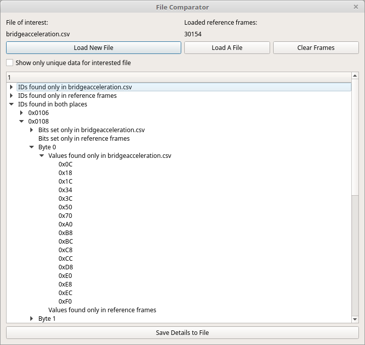

# File Comparison

File Comparison helps identify what changed between one capture of interest and one or more reference captures. It compares the CAN IDs and observed payload values on both sides, making it useful for isolating traffic associated with a physical event, operating mode, or test condition.

Use it when you have a question such as:

- Which IDs appeared only while I performed an action?
- Which payload bits changed between a baseline capture and an event capture?
- Which values are present during one condition but absent during another?
- Which IDs should I investigate next with Sniffer, Flow View, Signal Viewer, or a DBC?

## Comparison model

File Comparison uses two logical data sets:

| Set | Purpose |
|---|---|
| **File of Interest** | The capture that contains the behavior, event, or condition you want to investigate |
| **Reference Frames** | One or more baseline captures used for comparison |

The reference side can contain frames loaded from multiple files. SavvyLens combines those frames into one reference collection before comparing them with the File of Interest.

This lets you compare one focused test capture against a broad baseline rather than limiting the comparison to only one reference file.

## Typical workflow

1. Capture or load one or more baseline files that do **not** contain the event you are trying to identify.
2. Capture or load a **File of Interest** that contains the event, action, or state change.
3. Add the baseline files as reference frames.
4. Run the comparison.
5. Review IDs found only on one side.
6. Expand IDs found in both collections to inspect value and bit differences.
7. Use the most promising IDs in other SavvyLens tools for deeper analysis.

For example:

1. Capture ordinary vehicle traffic while parked or idling.
2. Perform the action you want to study, such as changing gear, pressing a button, or enabling a feature.
3. Capture that session as the File of Interest.
4. Compare it against the ordinary-traffic reference capture.
5. Investigate IDs and payload values that appear only during the event.

## Results tree

The comparison results are organized into three main groups.

### IDs found only in File of Interest

This group contains every CAN ID found in the File of Interest but not in the reference frames.

These IDs are often useful starting points because they may represent traffic that occurs only during the target event or condition.

They are not automatically the answer, however. An ID can be unique because of unrelated timing, initialization, diagnostic activity, or another environmental difference between captures.

### IDs found only in reference frames

This group contains IDs that occurred in the reference collection but never appeared in the File of Interest.

These IDs can help identify background traffic that was absent during the test capture. They are usually less important when searching for event-specific behavior, but they can reveal an unexpected difference between the two capture conditions.

### IDs found in both

This group contains IDs observed in both collections.

Expand an ID to inspect its differences. This is often the most useful result group because a relevant signal may use an ID that is present in both captures but changes value only during the event.

Differences can reveal:

- Bits set only in the File of Interest.
- Bits set only in the reference frames.
- Values observed only in one side.
- Payload bytes that behave differently between the two data sets.

These differences are candidates for the signal, state, or event you are trying to identify.

## Choosing good captures

Comparison quality depends heavily on how similar the captures are apart from the event you want to study.

For best results:

- Use the same vehicle or device state for baseline and test captures.
- Keep the capture duration and surrounding activity similar.
- Avoid unrelated actions during the File of Interest capture.
- Repeat the target action more than once when practical.
- Use multiple baseline captures when normal traffic varies significantly.
- Record the time and conditions of each capture.

A capture taken while idling may be a useful baseline for a capture where a specific control was used. The more unrelated differences you introduce between the two captures, the more comparison noise you will need to filter through.

## Interpreting results

File Comparison identifies differences; it does not prove that a difference is the signal you want.

After finding a candidate ID or byte:

1. Filter the main frame table to that ID.
2. Use Sniffer to observe which bits change during repeated events.
3. Use Flow View or Frame Info to inspect values over time.
4. Add bookmarks around repeated physical events.
5. Repeat the event and verify that the candidate changes consistently.
6. Create or update a DBC signal only after confirming the bit layout and behavior.

## Troubleshooting

- **Too many differences:** Use a more controlled baseline, shorten captures, remove unrelated activity, or compare a narrower time range with Frame Bisector first.
- **No useful differences:** Confirm that the target event actually occurred during the File of Interest capture. Try repeating it multiple times or use a different baseline.
- **An ID appears only in the File of Interest but seems unrelated:** Compare additional captures. One-off initialization, diagnostic, or timing traffic can create false leads.
- **The expected ID appears in both groups but no difference is obvious:** The relevant change may be infrequent, multiplexed, scaled, or hidden among normal variation. Use Flow View, Sniffer, DBC interpretation, or a focused bisected capture for deeper inspection.