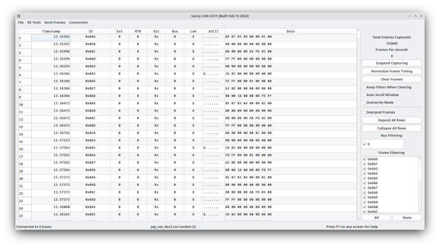

# Main Screen

The Main Screen is the center of SavvyLens. It contains the current CAN frame collection, capture controls, ID and bus filters, DBC interpretation controls, file load/save actions, and entry points to the other analysis windows.

Most SavvyLens workflows begin here:

1. Connect to a live CAN interface or load a capture file.
2. Confirm that frames are arriving in the main table.
3. Filter down to IDs or buses of interest.
4. Open analysis tools such as Sniffer, Flow View, Frame Info, Graphing, Signal Viewer, Bisector, Playback, or scripting.
5. Save the full capture or a filtered subset when you have isolated useful data.

You can keep multiple analysis windows open at the same time.

## Main frame table

The main table is the authoritative collection of frames currently captured or loaded into SavvyLens.

| Column | Meaning |
|---|---|
| Timestamp | Time assigned to the frame. Display mode is controlled by Preferences and can use seconds, microseconds, or system-clock time. |
| ID | The CAN message identifier, displayed in hexadecimal or decimal according to Preferences. |
| RTR | `0` for a normal data frame; `1` for a Remote Transmission Request frame. RTR frames request data and do not carry a normal payload. |
| Ext | `0` for an 11-bit standard CAN ID; `1` for a 29-bit extended CAN ID. |
| Dir | `Rx` for frames received by SavvyLens and `Tx` for frames sent by SavvyLens. |
| Bus | The physical or logical bus associated with the frame. Files without bus information load as bus `0`. |
| Len | Payload length: `0`–`8` bytes for classic CAN and up to `64` bytes for CAN FD. |
| ASCII | A text-oriented view of payload bytes. This can help identify ASCII-encoded values such as identifiers or VIN fragments. |
| Data | Payload bytes, shown in hexadecimal or decimal. With DBC interpretation enabled, decoded information can also appear here. |

Select a frame to inspect it more closely. When DBC interpretation is enabled, a frame with known signals can expand to show its decoded signal values.

The Preferences setting for maximum data bytes per line can make CAN-FD traffic easier to inspect without requiring an excessively wide window.

## Capture controls

### Suspend and resume capture

Use **Suspend Capturing** to temporarily stop adding received frames to the main collection while keeping connections active.

Use **Resume Capturing** to begin recording incoming frames again.

This is useful when you want to keep a device connected but exclude unrelated traffic between tests.

### Clear frames

Use **Clear Frames** to remove the current frame collection and free its associated memory.

> **Caution:** Clearing frames is irreversible unless you saved the capture first.

Enable **Keep Filters While Clearing** if you want to retain your current ID-filter selections after clearing the frame list. Otherwise, clearing frames also resets the filters.

### Normalize frame timing

**Normalize Frame Timing** shifts timestamps so that the earliest frame begins at `0`.

This is useful when:

- You started capturing long before the event you care about.
- You want captures to be easier to compare.
- You want a timeline relative to the beginning of the retained frame set.

### Auto scroll

Enable **Auto Scroll Window** to keep the main frame list near the newest incoming frames.

Auto scroll updates periodically for performance reasons, so the view may not remain exactly on the final row at every instant.

### Overwrite mode

Enable **Overwrite Mode** to show only the most recent frame for each message ID rather than every historical occurrence.

This is useful for live monitoring, especially with **Interpret Frames** enabled, because it keeps the display focused on each message’s current decoded state.

> **Note:** Overwrite Mode changes how the main table is displayed. Use normal mode when you need the complete frame history for analysis, export, graphing, comparison, or correlation work.

## Filtering frames

SavvyLens captures incoming frames even when they are hidden by the main-screen filters. Filtering controls what is displayed and, when selected during export, what is saved.

### Frame ID filtering

The **Frame Filtering** list contains every CAN ID seen in the current collection.

- Checked IDs are shown.
- Unchecked IDs are hidden.
- **All** selects every ID.
- **None** clears every ID selection.

A useful workflow for investigating a few IDs is:

1. Select **None**.
2. Enable only the IDs you want to study.
3. Open a supporting analysis window or export the filtered set.

You can save and load ID-filter lists to restore a useful working set later.

### Bus filtering

Use **Bus Filtering** to show or hide frames based on their bus number.

This is especially useful for multi-bus capture devices, bridge work, or capture files that contain traffic from more than one bus.

### Filtered exports

When saving frames, SavvyLens can export either:

- The complete frame collection.
- Only the currently filtered/visible frames.

Verify the save option before exporting. A filtered export is useful for sharing a focused research sample; a full export is safer when preserving the original capture.

## DBC interpretation

A DBC file defines how CAN message payloads should be interpreted as named signals.

For example, a message with ID `0x105` might contain a torque request in bytes `0` and `1`, a mode field in another byte, and a gear value represented by a named enumeration.

Load and manage DBC files through the **DBC File Manager** in the File menu.

Enable **Interpret Frames** to apply loaded DBC definitions to matching frames in the main table. With interpretation enabled, SavvyLens can display decoded signal values, message labels, and configured colors.

Use DBC interpretation when:

- You are monitoring known signals.
- You want human-readable labels instead of raw payload bytes alone.
- You are validating a DBC definition against live or captured traffic.
- You want to open Signal Viewer or create signal-aware graphs.

Disable it when:

- You want the cleanest possible raw-frame view.
- You are working with a very large capture and want to reduce interpretation overhead.
- You are looking for unknown payload changes without DBC context.

### Expanding interpreted rows

Use **Expand All Rows** to show decoded signals for every interpretable message.

> **Performance note:** Expanding every row can take a long time for a large capture. Filter to the relevant IDs first whenever possible.

Use **Collapse All Rows** to return the table to one row per frame.

## Loading and saving captures

SavvyLens supports many CAN log and capture formats. Support varies by format: some formats can be read and written, while others are import-only or export-only.

Common examples include:

- GVRET/SavvyLens native CSV.
- Generic ID/data CSV.
- CRTD / OVMS.
- BusMaster logs.
- Microchip logs.
- Vector and other vendor capture formats.
- PCAP/SocketCAN captures.

The current supported-format list is maintained in the project README.

### Saving with DBC decoding

The File menu also provides an export path that includes DBC-decoded signal information.

Use this when you need a readable result containing both raw frames and the interpreted signals derived from the loaded DBC definitions.

## Status bar and activity

The status bar provides three quick references:

| Area | Meaning |
|---|---|
| Connection status | Number of currently connected buses |
| Current file | The active file name, updated after loading or saving |
| Help reminder | Indicates that `F1` opens context-sensitive help |

The right-side activity area shows:

- Total captured frames.
- Current frame rate.

The total captured-frame count can differ from the number of visible rows when ID or bus filters hide part of the collection.

## Practical capture workflow

For a typical reverse-engineering session:

1. Connect to the target bus and verify expected traffic.
2. Clear frames, optionally retaining a useful filter set.
3. Start or resume capture.
4. Perform one controlled physical event or test action.
5. Suspend capture if you want to isolate that interval.
6. Filter to changing or relevant IDs.
7. Use Bookmarking, Sniffer, Flow View, Frame Info, Graphing, File Comparison, or Bisector to investigate the result.
8. Save the original capture before replacing, filtering, bisecting, or exporting a narrowed subset.

## Troubleshooting

- **No frames appear:** Confirm the connection is active, the correct bus is selected, capture is not suspended, and no bus/ID filter is hiding the traffic.
- **Only a few rows appear:** Check whether Overwrite Mode is enabled or filters are active.
- **DBC values do not appear:** Confirm that a DBC is loaded, Interpret Frames is enabled, the CAN ID matches a DBC message, and the signal definitions are correct.
- **The table is slow with a large capture:** Disable interpretation, avoid expanding all rows, filter to relevant IDs, or use a smaller subset.
- **Saved output is missing expected IDs:** Confirm whether you selected filtered export rather than full-capture export.