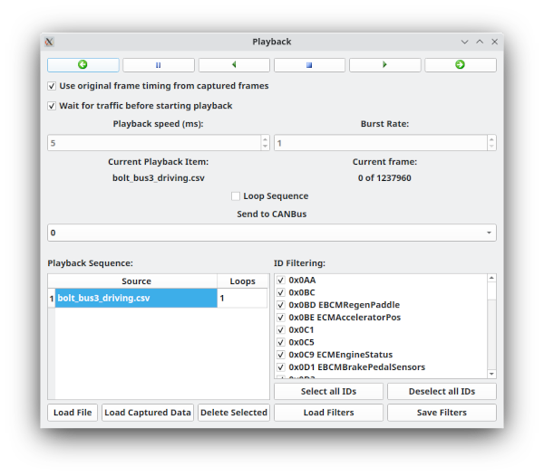

# Playback

Playback replays loaded or live-captured CAN frame sequences. It supports multiple sequence items, per-sequence frame selection and filtering, playback speed, burst rate, loop behavior, bus selection, original timing, wait-for-traffic behavior, and step controls.

> **Safety notice:** Playback transmits recorded traffic. Captured traffic may include commands that are unsafe or inappropriate to replay on a live system. Review the source, selected IDs, target bus, timing, and loop settings before pressing Play.

## Typical workflow

1. Open Playback.
2. Load a capture file or add frames from the current live frame collection.
3. Review the loaded sequence list and selected frame IDs.
4. Select the destination bus, `All`, or `From File` as appropriate.
5. Choose playback speed/burst behavior and whether to preserve original timing.
6. Use step controls for initial verification.
7. Start playback only after confirming filters and output bus.

Use the smallest possible test set before replaying a full capture.

## Playback sequence

The **Playback Sequence** section contains one or more sequence items. Each item is a capture source and a repeat count. SavvyLens can play one item multiple times before continuing to the next item in the sequence.

For example, you can configure Playback to:

1. Play the first capture twice.
2. Play the next capture once.
3. Play a third capture four times.

Each sequence item can come from one of two sources:

- **Load File** loads a capture or log file from disk.
- **Load Captured Data** uses a snapshot of the frames currently held in the main window.

When you load captured data, Playback takes a snapshot at that moment. Frames received later are not added automatically to that sequence item.

Each sequence item has its own frame cache and ID-filter selection. You can therefore replay different subsets of IDs from different captures in the same sequence.

Enable **Loop Sequence** to repeat the entire configured sequence continuously.

## Controls

| Control | Purpose |
|---|---|
| Load File | Adds a capture/log sequence from disk |
| Load Captured Data / Load Live | Uses the current captured-frame snapshot as a sequence source |
| Previous Frame | Sends or selects the previous frame one frame at a time |
| Pause | Temporarily halts active playback |
| Play Reverse | Starts reverse playback |
| Stop | Ends playback and returns to the first frame of the first sequence item |
| Play Forward | Starts forward playback |
| Next Frame | Sends or selects the next frame one frame at a time |
| Original Timing | Uses source timestamps rather than only the selected interval |
| Playback Speed | Sets the interval, in milliseconds, for scheduled playback |
| Burst Rate | Sets how many frames are sent at each scheduled playback interval |
| Loop Sequence | Repeats the complete configured sequence |
| ID List | Selects which CAN IDs are included for the current sequence item |
| Wait for Traffic | Waits for received CAN traffic before beginning requested playback |

## Selecting output buses

Playback can send frames in three ways:

- Select a specific bus to send all playback frames to that bus.
- Select **All** to send frames to every available bus.
- Select **From File** to use each frame’s recorded bus number.

> **Warning:** `All` can transmit traffic to every connected bus. Use it only when that is explicitly intended.

Some capture formats preserve the source bus number, and SavvyLens also stores bus information for captured frames. With **From File**, those frames can be sent back to their associated buses.

If the capture does not contain usable bus information, frames default to bus `0`. Verify the resulting bus selection before starting playback.

Playback refreshes its available bus list when the window is shown.

## Frame selection and filter files

The ID list controls which frame IDs are included for the currently selected sequence item. Unchecked IDs are excluded from playback.

Playback can save and load ID-filter definitions using `.ftl` files. This is useful when you repeatedly replay the same subset of a capture.

Because filters are stored per sequence item, one capture can replay a different set of IDs than another capture in the same playback sequence.

## Timing and burst behavior

Playback has two timing modes.

### Original timing

Enable **Use original frame timing from captured frames** to replay frames using their recorded timing as closely as practical.

Desktop operating systems cannot guarantee exact millisecond-level transmission timing. Closely spaced frames may have a small amount of timing jitter, but original timing is generally the preferred setting when reproducing a recorded capture.

### Scheduled timing

Disable original timing to use a fixed schedule.

- **Playback Speed** sets the interval between playback ticks in milliseconds.
- **Burst Rate** sets the number of frames transmitted on each tick.

For example, a burst rate of `5` with a playback speed of `10 ms` sends up to five frames every 10 milliseconds.

Scheduled timing can provide a more predictable frame rate, but it can substantially alter the original traffic timing. Use it carefully, particularly when replaying traffic to a live device.

## Wait for traffic

**Wait for Traffic** delays playback after you request forward or reverse playback. SavvyLens remains in a waiting state until it receives CAN traffic, then begins playback automatically.

While waiting, the status area shows `(WAITING)` near the current-frame information.

This can be useful when:

- You need a vehicle or device to power on before replay begins.
- You want to wait until connected buses are active.
- You need playback to begin immediately after observed traffic rather than at an arbitrary time.

## Playback status

Below the Playback Speed and Burst Rate controls, the status area shows the active sequence item and the current frame position within that item.

Use this information with the step controls to verify that the expected sequence and frame selection are being replayed.

## Safety checklist

Before starting playback:

- Confirm the source capture and selected sequence item.
- Confirm which CAN IDs are enabled in the ID list.
- Confirm the target bus, especially when using `All` or `From File`.
- Confirm whether **Loop Sequence** is enabled.
- Confirm whether original timing or scheduled timing is selected.
- Begin with step controls or a small filtered sequence whenever possible.
- Stop playback before changing bus assumptions, connection state, or live-system conditions.