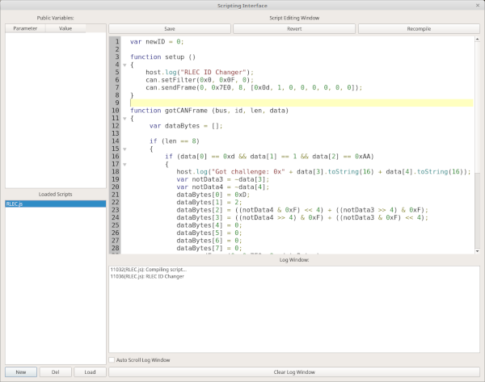

# Scripting



The Scripting window provides JavaScript automation for CAN, ISO-TP, and UDS workflows. It includes an editor, script list, validation, runtime logging, public-variable display, and built-in templates.

Scripts can run concurrently. They can subscribe to traffic, send traffic, provide periodic behavior, write messages to the shared log, and expose parameters that you can edit while the script runs.

> **Safety notice:** A script can send CAN, ISO-TP, or UDS traffic. Validate scripts and begin with non-transmitting monitoring logic whenever possible. Confirm the selected bus, CAN ID, and payload before transmitting on live hardware.

## Script lifecycle

1. Create a new script or load a `.js` file.
2. Insert a built-in template if it provides a useful starting point.
3. Edit the script and select **Validate** before running it.
4. Run one script or all enabled scripts.
5. Watch the log and public-variable table for runtime state and errors.
6. Stop scripts before changing live traffic assumptions or closing the window.

The **Loaded Scripts** list is in the lower-left area of the window:

- **New** creates a new script. It receives a temporary random name until you save it.
- **Load** opens an existing script file.
- **Save** stores the selected script.
- **Del** removes the selected script after confirmation.
- **Revert** restores the script to the last successfully compiled version.
- **Recompile** compiles the current script and begins running the new version.

Closing the Scripting window stops all scripts as a safety measure.

## Templates

Built-in templates are installed with SavvyLens. User templates are stored separately in a writable user location. Saving a script as a template does not modify the built-in template set.

Templates are intended as starting points. Read and validate a template before running it, especially if it contains calls that transmit CAN, ISO-TP, or UDS traffic.

## Runtime status

The window provides two primary ways to monitor a script.

### Log window

The **Log Window** appears below the editor. It is shared by all loaded scripts and displays compilation results and messages written by scripts.

Each log entry includes the script name and the elapsed time since the Scripting window opened. Compilation errors also appear here. Enable **Auto Scroll Log Window** to keep the view at the newest entry, and use the clear action when you need a fresh log.

### Public variables

Scripts can register values as **Public Variables**. The selected script’s registered variables appear in the public-variable table, where you can monitor them and, when appropriate, edit their values.

Use public variables carefully:

- Changes you make in the UI are made available to the script.
- Script-side changes are reflected in the UI periodically.
- Avoid editing a value that the script treats as read-only status information.
- Prefer the Log Window for event messages and debugging output; use public variables for values that benefit from frequent display or controlled user input.

## Writing scripts

SavvyLens scripts use JavaScript, but they do not run in a web browser. Browser-specific APIs are not available. Instead, SavvyLens provides the `host`, `can`, `isotp`, and `uds` objects to interact with the application and connected buses.

Scripts use the `.js` extension. The window remembers the most recent load/save directory through application settings.

## Callback functions

Define these functions in a script when you need their corresponding behavior.

### `setup()`

SavvyLens calls `setup()` when the script starts. Use it to initialize variables, configure filters, register public parameters, configure a tick interval, or log startup status.

```javascript
function setup()
{
    host.log("Script started");
    can.setFilter(0x123, 0x7FF, 0);
}
```

### `tick()`

If the script enables a periodic tick through `host.setTickInterval(interval)`, SavvyLens calls `tick()` at that interval.

A script has one tick handler. If you need multiple effective rates, use one sufficiently fast tick interval and dispatch slower work yourself.

```javascript
function tick()
{
    // Periodic work goes here.
}
```

### `gotCANFrame(bus, id, len, data)`

SavvyLens calls this when a received CAN frame matches a filter registered with `can.setFilter()`.

```javascript
function gotCANFrame(bus, id, len, data)
{
    host.log("Received CAN ID: 0x" + id.toString(16));
}
```

### `gotISOTPMessage(bus, id, len, data)`

SavvyLens calls this for received ISO-TP messages that match a filter registered with `isotp.setFilter()`.

```javascript
function gotISOTPMessage(bus, id, len, data)
{
    host.log("Received ISO-TP message from 0x" + id.toString(16));
}
```

### `gotUDSMessage(bus, id, service, subfunc, len, data)`

SavvyLens calls this for received UDS messages that match a filter registered with `uds.setFilter()`.

```javascript
function gotUDSMessage(bus, id, service, subfunc, len, data)
{
    host.log("Received UDS service: 0x" + service.toString(16));
}
```

## The `host` object

The `host` object provides application-level scripting helpers.

### `host.setTickInterval(interval)`

Sets the interval, in milliseconds, for calling `tick()`.

- A value greater than `0` enables periodic calls to `tick()`.
- A value of `0` stops the tick timer.

```javascript
host.setTickInterval(250);
```

### `host.log(text)`

Writes text to the shared Log Window. SavvyLens adds timing and script-name information to the entry.

```javascript
host.log("Waiting for a matching CAN frame");
```

### `host.addParameter("variableName")`

Registers a script variable as a Public Variable.

Pass the **name** of the variable as a quoted string, not its current value.

```javascript
var targetSpeed = 10;

function setup()
{
    host.addParameter("targetSpeed");
}
```

## The `can` object

The `can` object interfaces with raw CAN frames.

### `can.setFilter(id, mask, bus)`

Registers a CAN receive filter. A received frame is delivered to `gotCANFrame()` when its bus matches and its masked ID matches the configured ID.

```javascript
can.setFilter(0x230, 0x7F0, 0);
```

For example, an incoming ID of `0x235` with mask `0x7F0` becomes `0x230`. It therefore matches a filter ID of `0x230`. This mask accepts IDs `0x230` through `0x23F`.

### `can.clearFilters()`

Removes all registered raw-CAN filters. The script will no longer receive `gotCANFrame()` callbacks until it registers another filter.

```javascript
can.clearFilters();
```

### `can.sendFrame(bus, id, length, data)`

Sends a CAN frame on the selected bus.

```javascript
can.sendFrame(0, 0x7E0, 8, [0x02, 0x10, 0x01, 0, 0, 0, 0, 0]);
```

Use an array of byte values for `data`. Confirm that the bus is connected and is not in listen-only mode before expecting transmission. Verify the intended ID, length, and payload before calling this function on a live bus.

## The `isotp` object

The `isotp` object handles ISO-TP messages. It uses SavvyLens protocol handlers and therefore depends on active CAN transport configuration.

### `isotp.setFilter(id, mask, bus)`

Registers an ISO-TP receive filter. SavvyLens delivers matching, valid ISO-TP traffic to `gotISOTPMessage()`.

```javascript
isotp.setFilter(0x7E8, 0x7F8, 0);
```

Frames that cannot be interpreted as ISO-TP messages are not delivered through this callback.

### `isotp.clearFilters()`

Removes all ISO-TP filters.

```javascript
isotp.clearFilters();
```

### `isotp.sendISOTP(bus, id, length, data)`

Sends an ISO-TP message. SavvyLens handles multi-frame messages and ISO-TP flow control as needed.

```javascript
isotp.sendISOTP(0, 0x7E0, 3, [0x22, 0xF1, 0x90]);
```

## The `uds` object

The `uds` object works with UDS messages carried over ISO-TP.

### `uds.setFilter(id, mask, bus)`

Registers a UDS receive filter. SavvyLens delivers matching, recognizable UDS traffic to `gotUDSMessage()`.

```javascript
uds.setFilter(0x7E8, 0x7F8, 0);
```

### `uds.clearFilter()`

Removes UDS filters.

```javascript
uds.clearFilter();
```

### `uds.sendUDS(bus, id, service, sublen, subfunc, length, data)`

Sends a UDS request.

```javascript
uds.sendUDS(0, 0x7E0, 0x22, 2, 0xF190, 0, []);
```

`service` must be between `0x00` and `0xFF`. `subfunc` may occupy more than one byte when needed. The `data` argument is for extended payload data; SavvyLens handles the UDS/ISO-TP transport structure.

## Example monitoring script

This example listens for CAN ID `0x123` on bus `0` and logs matching frames. It does not transmit traffic.

```javascript
function setup()
{
    host.log("Starting CAN monitor");
    can.setFilter(0x123, 0x7FF, 0);
}

function gotCANFrame(bus, id, len, data)
{
    host.log(
        "Bus " + bus +
        ", ID 0x" + id.toString(16) +
        ", length " + len
    );
}
```

## Troubleshooting

- Use **Validate** before running a changed script.
- Double-click a runtime error in the Log Window to navigate to its reported line when supported.
- Confirm bus number, CAN ID, frame length, and payload before transmitting.
- If no receive callback occurs, check active filters and verify that the selected connection is receiving traffic.
- If a script does not receive ISO-TP or UDS callbacks, confirm that the incoming traffic is valid for that protocol and that the expected filters are registered.
- If the script cannot transmit, confirm that the target bus is connected and not configured as listen-only.
- Use `host.log()` generously while developing; it is generally safer and clearer than trying to expose every intermediate value as a Public Variable.