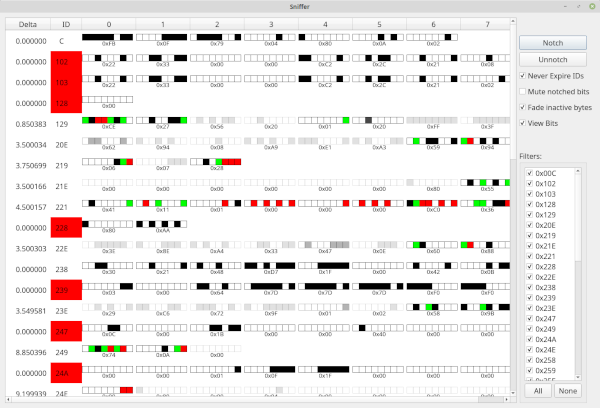

# Sniffer

Sniffer is a live-change view for CAN traffic. It focuses on frames and payload bytes that are actively changing, making it useful for finding candidate signals while you perform a controlled physical action.

It is conceptually similar to the Linux `cansniffer` utility, with additional filtering and visual-analysis controls.

## Typical workflow

1. Connect to the target CAN bus and confirm frames are arriving.
2. Open Sniffer.
3. Use filters to hide IDs that are not relevant.
4. Let normal background traffic run briefly.
5. Use **Notch** to de-emphasize bits that are already changing.
6. Perform one controlled action, such as pressing a button or moving a control.
7. Look for newly changing IDs, bytes, or bits.
8. Use the resulting candidate IDs in Flow View, Frame Info, Graphing, Bookmarking, or DBC work.

This works best when you change one thing at a time and know which unrelated traffic should be ignored.

## How Sniffer displays changes

Sniffer displays frames ordered by CAN ID and refreshes approximately every 200 milliseconds.

By default:

- IDs that are actively received remain visible.
- An ID that has not been received for approximately 5 seconds turns red, then disappears.
- Bytes that increased are shown in green.
- Bytes that decreased are shown in red.
- IDs can be excluded with the Filters area.

This behavior helps focus attention on active traffic rather than a permanent list of every ID seen in the capture.

## Filters

Use the **Filters** area to prevent selected IDs from appearing in Sniffer.

Filtering is useful when:

- You already know certain IDs are unrelated.
- A high-rate ID makes the view difficult to read.
- You want to isolate traffic from one subsystem or experiment.
- You have identified a candidate ID and want to focus on related traffic.

Filters change what Sniffer displays; they do not change the underlying captured-frame collection.

## Notching changing bits

**Notch** is the primary feature for ignoring known background activity.

During each approximately 200-millisecond update period, Sniffer records which bits changed. Selecting **Notch** adds the recently changed bits to the set of notched bits.

After a bit is notched:

- It can continue updating.
- Its future changes are no longer highlighted by default.
- Repeated use of **Notch** adds more recently changing bits to the ignored set.

Use **Un-notch** to clear all notched-bit information and restore normal change highlighting.

### Example: finding a steering-related signal

1. Leave the steering wheel still.
2. Let Sniffer observe normal traffic.
3. Select **Notch** several times to suppress bits that change while the steering wheel is stationary.
4. Move the steering wheel.
5. Look for bytes or bits that now change and were not previously notched.

The same approach can help isolate signals related to buttons, gear selection, speed, pedals, switches, or other controlled events.

> **Note:** Notching is an analysis aid, not a data filter. By default, a notched bit can still update in the displayed payload; it simply stops receiving change-color emphasis.

## Display options

### Never Expire IDs

Enable **Never Expire IDs** to keep IDs in the list even after they stop arriving.

Use this when you want a stable list of IDs rather than one that changes as inactive IDs expire.

Without this option, inactive IDs turn red and disappear after roughly 5 seconds.

### Mute Notched Bits

Enable **Mute Notched Bits** to suppress display updates caused only by notched-bit changes.

This makes remaining changes easier to spot, but it also means the displayed payload may not fully represent the latest true payload values for those IDs.

> **Caution:** With muting enabled, the view is intentionally simplified for analysis. Do not treat it as an exact raw-frame display.

### Fade Inactive Bytes

Enable **Fade Inactive Bytes** to gradually fade bytes that have not changed recently.

This makes actively changing data stand out while making stable data less visually prominent.

Fade can be used with or without muted notched bits.

### View Bits

Enable **View Bits** for a bit-level representation instead of the normal byte-oriented view.

Each bit is shown individually:

| Color | Meaning |
|---|---|
| White | Bit is clear and unchanged |
| Black | Bit is set and unchanged |
| Green | Bit was newly set |
| Red | Bit was newly cleared |

Bit view is useful for locating a single changing bit, flag, toggle, or status field. It is more detailed but shows fewer IDs at one time.

**Fade Inactive Bytes** and **Never Expire IDs** still apply in bit view.

## Practical analysis tips

- Start with the default view before enabling advanced display options.
- Use normal byte view to locate candidate messages quickly.
- Switch to bit view after you identify an ID with interesting changes.
- Notch background activity before performing the event you want to correlate.
- Use filtering to remove unrelated high-rate traffic.
- Use **Never Expire IDs** when comparing intermittent or sparse messages.
- Avoid **Mute Notched Bits** until you understand which data you are intentionally hiding.
- Confirm a candidate with another tool before drawing conclusions from a highlighted change.

## Troubleshooting

- **Too many IDs are visible:** Use Filters, then notch background-changing bits.
- **An ID disappears before you can inspect it:** Enable **Never Expire IDs**.
- **Changes are still too noisy:** Notch repeatedly while the system is in a known steady state.
- **The display no longer matches the actual payload:** Check whether **Mute Notched Bits** is enabled.
- **You need to find a one-bit flag:** Enable **View Bits**, filter to candidate IDs, and repeat the controlled event.
- **Nothing updates:** Confirm SavvyLens is receiving frames on the expected connection and that the relevant IDs are not filtered out.